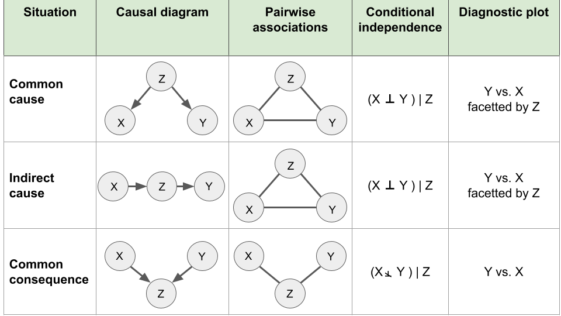
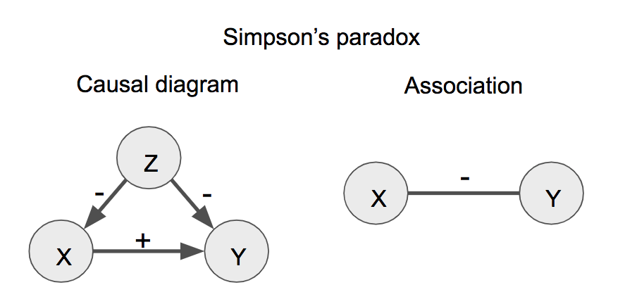

 
```{r setup, include=FALSE} 
knitr::opts_chunk$set(warning = FALSE, message = FALSE) 
```

#  Descriptive vs. associative plots

### Descriptive plots (unsupervised learning)

* p(X), where X is the variable we want to explore
*  Univariate data: histograms, single boxplots or violin plots. 
* Multivariate data: clustered heatmaps, PCA projections...

### Associative plots (supervised learning)

*  p(y|x) (pronounced “p of y given x”)
* y-axis for the response variable and the x-axis for the explanatory variables: side-by-side boxplotsy (quartiles, median)~x, scatter plots (trend)...


### Examples
##### Diamonds data set

```{r}
library(ggplot2)
ggplot(diamonds, aes(carat)) + geom_histogram() 
ggplot(diamonds, aes(carat, price)) + 
  geom_point(alpha = 0.05) + geom_smooth() #Alpha refers to the opacity of a geom. 

```

#  Correlation and causation

* Claims are better supported using associative plots between an appropriate response variable on the y-axis against an appropriate dependent variable on the x-axis.
* Causal conclusions can be established in specific cases where the data has been gathered in a controlled fashion.  This includes experimental perturbations where a single variable is changed and every other condition is kept the same
* With observational data (without the possibility to control the conditions), we can assess statistical dependencies, or associations, between variables such as correlations, enrichments, etc. However, these do not necessarily imply a causal link (like “spurious correlations”, Graphically supported hypotheses).


```{r , echo=FALSE, fig.cap="Meme", out.width = '100%'}
 
```


### The association is not statistically supported

The observed association between variables arose by chance. Would the data collection be repeated, or performed for a longer period of time, the association would not show up any longer. There are two main reasons for this:

* The association is driven by few data points.

* The dataset includes so many variables that the chance to have one pair of variables associating is high. This is generally called **data dredging**, **data fishing**, **data snooping**, or **cherry picking**. 

[Website for examples](https://www.tylervigen.com/spurious-correlations)

### Reversing cause and effect

Unlike causal relationships, statistical dependencies are symmetric (if A correlates with B, then B correlates with A). A typical mistake are claims where cause and effects are reversed.

### The association is induced by a third variable

We denote x⊥y when variables x and y are statistically independent and x⊥/y when they are dependent. Also, (x⊥y)|z means that x and y are independent given z.

```{r pressure, echo=FALSE, fig.cap="Causal diagrams", out.width = '100%'}
 
```
#####  Common cause
```{r}
# example :
set.seed(0)
library(data.table)
n <- 1000 
z <- rbinom(n,2,0.5)
x <- rnorm(n,z,1)
y <- rnorm(n,2*z,1)
dt <- data.table(
    x,y, 
    z = factor(paste0("z=",z))
  )
table(z)
ggplot(dt, aes(x=z, y=x)) + geom_boxplot()
ggplot(dt, aes(x=z, y=y)) + geom_boxplot()
ggplot(dt, aes(x=x, y=y)) + geom_point()+ geom_smooth()
cor(x,y)
```

To visualize the common cause:
```{r}
ggplot(dt, aes(x=x, y=y)) + geom_point() + facet_wrap(~z)
cor(dt[z=="z=2",x],dt[z=="z=2",y])
# cor(dt[z=="z=1",x],dt[z=="z=1",y])
# cor(dt[z=="z=0",x],dt[z=="z=0",y])
# dt[, .(correlation=cor(x,y)), by=z]
```
x and y are correlated, but their correlation is explained by z.

#####  Indirect association

We now simulate the case of an indirect association. To this end we consider the following process:

    We toss a coin once. We record x=1

      if it is a head, and x=0 if it is a tail.
      If x=0, we toss the coin once. If x=1, we toss the coins twice. We record z , the number of heads of this second step.
      We draw a value y randomly according to a Gaussian distribution with mean equal to z and standard deviation 0.5. 
      
```{r}
x <- rbinom(n, size=1, prob=0.5)
z <- rbinom(n, size=x+1, prob=0.5)
y <- rnorm(n, mean=z, sd=0.5)
dt <- data.table(
  x = factor(paste0("x=",x)),
  y, 
  z = factor(paste0("z=",z))
)
ggplot(dt, aes(x=x, y=y)) + geom_boxplot()
ggplot(dt, aes(x=x, y=y)) + geom_boxplot() + facet_wrap(~z)
```
Conditioning on the third variable has helped ruling out a direct causal relation between x and y. Note, however, that in this simulation there is an indirect causal relation between x and y. From an observational data point of view, the situation is very similar to the common cause situation. **Interpretations from the application field are needed to suggest whether such data supports an indirect association or a common cause.**

#####  Common consequence

```{r}
x <- rnorm(n) 
y <- rnorm(n)  
z <- x+y > 1  
dt <- data.table(x, y, z)
cor(x,y)

ggplot(dt[z == TRUE], aes(x=x, y=y)) + geom_point() + geom_smooth()
dt[, .(correlation=cor(x,y)), by=z] #  Berkson’s paradox
#  Hollywood stars tend to act worse than than less beautiful stars.
```

* Conditioning should not be done systematically.
* The data may already be conditioned and we are not aware of it! The data may have undergone some filtering during data analysis, or, less obviously, during data collection. Those possibilities should be considered when reporting associations between variables.

### Simpson’s paradox

In 1951, Simpson demonstrated that a statistical relationship observed within a group of individuals could be reversed within all subgroups that make up that population. This phenomenon, where a variable X seems to relate to a second variable Y in a certain way, but flips direction when the stratifying for another variable Z, has since been referred to as Simpson’s paradox.

```{r , echo=FALSE, fig.cap="Simpson Paradox", out.width = '100%'}
 
```
#  Data presentation as story telling


* Understand who our audience is considering its background and interests.
* A good presentation is like a good story^[ A story is a set of observations, facts, or events, that are presented in a specific order such that they create an emotional reaction in the audience. The emotional reaction is created through the build-up of tension at the beginning of the story followed by some type of resolution towards the end of the story. We refer to the flow from tension to resolution also as the story arc, and every good story has a clear, identifiable arc.], is easy to understand, has a clear message and is exciting.


##### For more:

https://gagneurlab.github.io/dataviz/graph-supported-hypos.html#the-association-is-induced-by-a-third-variable
