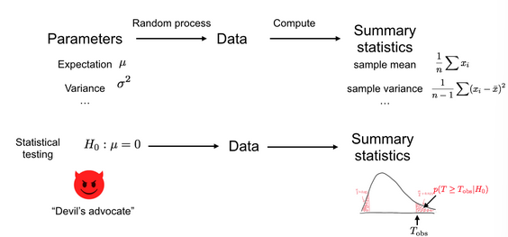
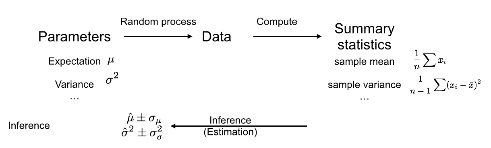
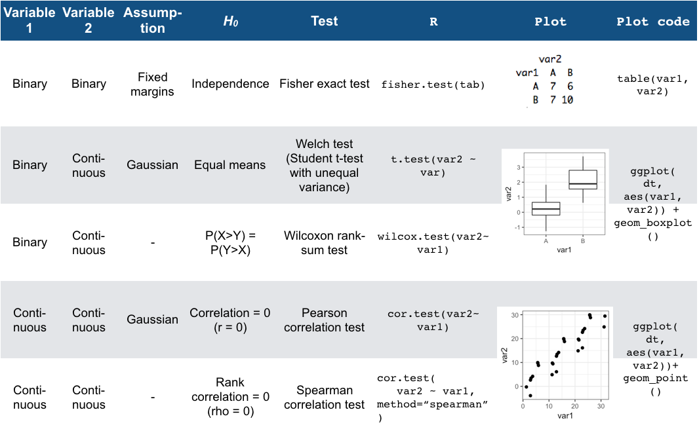
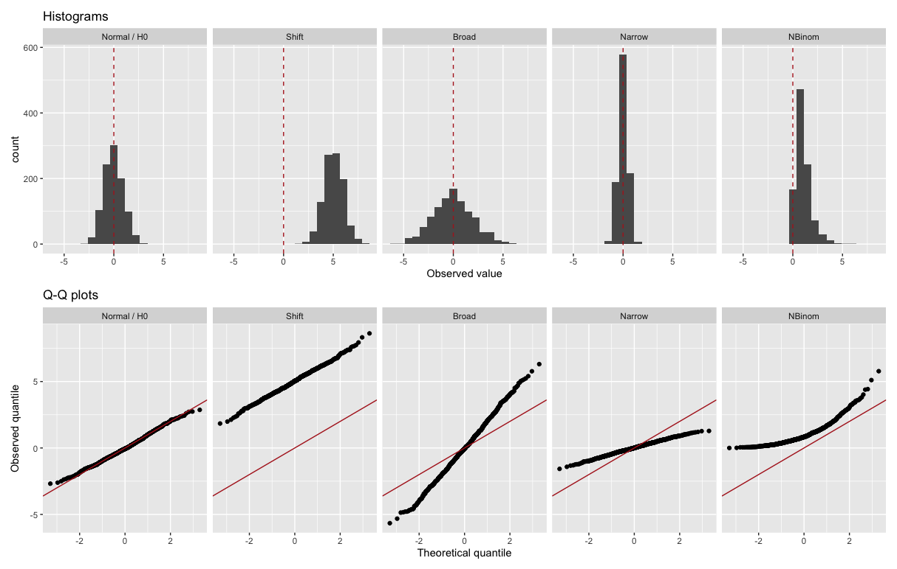

 


```{r, setup, include=FALSE}
knitr::opts_chunk$set(echo = TRUE)
options(knitr.table.format = function() {
  if (knitr::is_latex_output()) 'latex' else 'pandoc'
})
```


```{r , echo=FALSE, fig.cap="hypothesis testing", out.width = '100%'}
 
```


We assume an underlying random process (i.e. ‘Nature’). We collected data which is a particular realization of this random process, and from this data we computed a test statistic. In the bottom row, we now play the role of the Devil’s advocate and assume that the underlying random process conforms to the null hypothesis. Based on this assumption, different realizations of the dataset could arise as different realizations of the random process, for which the test statistics would get different values. Then we compute how likely it is to observe the test statistics as extreme as, or more extreme than the ones we got from our actual data. We use this probability to reject or not the null hypothesis.

## Test statistic

 To develop a test, we first need to define a test statistic. This is a single number that summarizes the data and captures the trend. Some statistics are more useful than others, because one can work analytically with them (see next notebook) or because they are more sensitive. 
 
 
##  The Null Hypothesis

A test statistic is calculated from a limited number of observations. In our data we see a large difference in median growth rates, but maybe if we had much more data, this difference would disappear, or even change sign. To assess this, we need a negative control. We get such a negative control by setting a null hypothesis *H_0*.

The null hypothesis can be compared to the proverbial “Devil’s Advocate.” To test whether a trend is real, we take the skeptical position and assume it is not. The exact null hypothesis depends on the problem.

##   The P-value

Under the null hypothesis *H_0*, the test statistic T follows a certain distribution $p(T|H_0)$. The P-value is the probability of obtaining a test statistic the same as or more extreme than the one we actually observed, under the assumption that the null hypothesis is true.

The formal definition of the P-value depends on whether we take “more extreme” to mean greater, less, or either way:

* For right-tail events: $P = p(T \geq T_\text{obs}| H_0)$
* For left-tail events: $P = p(T \leq T_\text{obs}| H_0)$
* For double tail events: $P = 2\min \{p(T \leq T_\text{obs}| H_0), p(T \geq T_\text{obs}| H_0) \}$

The null hypothesis is said to be rejected for sufficiently small P-values. In this case we say the result is statistically significant. It is common practice in the scientific literature to set a significance level of $α=0.05$ and rejecting the null hypothesis if $P<α$.

* When to apply one-sided or two-sided tests?

 In most scenarios the two-tailed test will be most appropriate, as generally there is no reason to privilege effects in one direction over another direction. A one-tailed test will only make sense if you have very good reason (before looking at the data!) that only the effect in one direction is important.

###  intuition on Hypothesis Testing and the P-value

<font size="2"> Suppose a murder has been committed, and a man has been accused of being the murderer. Under German law he is considered innocent until proven guilty. So, our null hypothesis is that the man is innocent. But we also collect some evidence. For example, we discover that the murder weapon had his finger prints on it, that a witness saw him near the crime scene and that he bought chemicals used to dispose of corpses one day before the crime. None of these facts constitute hard proof that he did commit the crime, but assuming he was innocent, it would require a lot of unlikely coincidences. This corresponds to a scenario where the P-value is low. Thus, we reject the null hypothesis of innocence and convict him. </font>


The *P-value* is not the probability of the observed test statistic given that the null hypothesis is true: $p(T \geq T_\text{obs}| H_0) \neq p(T=T_\text{obs} | H_0)$. The problem with basing a test on $ p(T=T_\text{obs} | H_0)$ is that it is dependent on the space of possibilities (If T is continuous, the probability is zero). Also, the P-value is not the probability that the null hypothesis is true given the data: $p(T \geq T_\text{obs}| H_0) \neq p(H_0 |T=T_\text{obs})$ “absence of evidence is not evidence of absence”. When the P-value is less than the chosen significance level, we reject the null hypothesis. But, in this framework, there is no mechanism to accept the null hypothesis. We can only fail to reject it.

The i.i.d. assumption should be questioned.

##   Confidence intervals
#### Parameter estimation


```{r , echo=FALSE, fig.cap="Parameter estimation", out.width = '100%'}
 
```
As before, there is a random process which produced our data, on which we compute summary statistics. But rather than just rejecting a null hypothesis, we now want to infer a parameter from our summary statistics, and also get an idea how precise our inference is. The confidence interval is a method to quantify our uncertainty about a parameter estimate. 

* Repeating experiments.
* eCDF $F_n(x) = \frac{1}{n}\sum_{i=1..n}I_{x_i \leq x}$. The eCDF tells us, for any value x, the proportion of observations less than or equal to x.
* Case resampling bootstrap
$p(\theta \in C)=1-\alpha$
* Many misuses of *P-values* in the scientific literature have been reported, the most obvious being to repeat an experiments until one finally gets $P<0.05$ and only report this observation in a publication.

## Analytical Statistical Assessment

* When we do many tests, we will usually require far lower P-values to reject the null hypothesis.
* With permutation testing, we estimated P-values using $P=\frac{r+1}{m+1}$, where m is the number of permutations.

## The Binomial Test: testing hypotheses for a single binary variable

```{r, include=TRUE}
set.seed(7)  
n <- 10
x <- sample(c(0,1), n, replace=TRUE, prob=c(0.5,0.5))
t <- sum(x)
#  function has three parameters, which correspond to Tobs, n and the μ under H0 respectively (R calls the last one p)
binom.test(t, n, p = 0.5, alternative = c("two.sided") )
```


##  Fisher’s exact test: Testing the association between two binary variables


Fisher's exact test is a statistical test used to determine if there is a significant association between two categorical variables. It is used when the sample size is small and the distribution of the variables is not normal. The test calculates the probability of obtaining a specific distribution of values, or one more extreme, given the marginal totals of the table.

It is commonly used in the analysis of nominal (categorical) data. The test is based on the probability of obtaining the observed frequencies or more extreme values, assuming that the null hypothesis is true.

An example of its use would be in a medical study where researchers want to determine if a new treatment is effective. The study is conducted on a sample of 100 patients, with 50 receiving the new treatment and 50 receiving a placebo. The researchers record the number of patients who recover from the disease in each group. The contingency table would look like this:


| Treatment     | Recover | Not recover |
|---------------|---------|-------------|
| New treatment | 40      | 10          |
| Placebo       | 30      | 20          |


The null hypothesis is that the treatment has no effect on the recovery rate. The alternative hypothesis is that the treatment is effective. Using Fisher's exact test, the researchers can calculate the probability of obtaining the observed frequencies or more extreme values, assuming that the null hypothesis is true. If this probability is low, for example, less than 0.05, the researchers can reject the null hypothesis and conclude that the treatment is effective.

This example is a two-tailed test where the alternative hypothesis is greater than or less than the null hypothesis. If the alternative hypothesis was that the treatment is greater than placebo then it would be one tailed test.


```{r}
library(data.table)
tbl = data.table(
  severe = c(10, 10),
  mild = c(20, 70)
)
tst <- fisher.test(tbl,  alternative = "greater")
tst
```

##  Testing the association between one quantitative and one binary variable

### T-test
A t-test is a statistical test used to determine if there is a significant difference between the means of two groups. The test is commonly used to compare the means of two independent samples, although it can also be used to compare the means of two dependent samples (paired data).

There are two main types of t-tests: the Student's t-test and the Welch's t-test. The Student's t-test is used when the variances of the two groups are equal, while the Welch's t-test is used when the variances are not 

The Wilcoxon Rank-Sum test is a popular alternative to the t-test for non-Gaussian data. It makes very few assumptions about the data, namely that:

    All observations x1,...,xnx,y1,...,yny are independent of each other
    The responses are ordinal, i.e. we can rank them
$H_0: p(X > Y) = p(Y > X)$ (we would expect that x>y occurs as often as y>x )

$U_x = R_x -\frac{n_x(n_x+1)}{2}$ The Mann-Whitney U statistic is defined as:

$U=min{Ux,Uy}$ where Rx is the sum of the ranks of the xi’s and nx is the number of observations of set X.

The Wilcoxon rank-sum test makes less assumptions than the t-test, specifically because it does not require that the data follows a Gaussian distribution. But do note that there is a flip side to this: if the data is indeed Gaussian, then the t-test will be more powerful (i.e. more sensitive in detecting violations of the null hypothesis) than the more generally applicable Wilcoxon rank-sum test.

```{r}
# Might give an error
#  Student’s t-test in R
#t.test(growth_rate ~ genotype, data=dt, var.equal=TRUE)
# Unequal variance (Welch’s test) in R
#t.test(growth_rate ~ genotype, data=dt)
# Wilcoxon rank-sum test: An alternative to the t-test for non-Gaussian data

#Wilcoxon rank-sum test in R
#wilcox.test(growth_rate ~ genotype, data=dt)

# Generate data
set.seed(69)
group1 = rnorm(30, mean = 5, sd = 1)
group2 = rnorm(30, mean = 6, sd = 1)

# t-test with equal variance
t.test(group1, group2, var.equal = TRUE)

# t-test with unequal variance
t.test(group1, group2, var.equal = FALSE)

# Wilcoxon rank-sum test
wilcox.test(group1, group2)


# Plot the difference between the two groups
library(ggplot2)
data = data.frame(group = c(rep("group1", 30), rep("group2", 30)),
                  value = c(group1, group2))

ggplot(data, aes(x = group, y = value)) +
  geom_boxplot() +
  ggtitle("Comparison of Group1 and Group2")


# Generate data
set.seed(69)
group1 = rlnorm(30, meanlog = 5, sdlog = 1)
group2 = rlnorm(30, meanlog = 6, sdlog = 1)

# t-test with equal variance
t.test(group1, group2, var.equal = TRUE)

# Wilcoxon rank-sum test
wilcox.test(group1, group2)

# Plot the difference between the two groups
library(ggplot2)
data = data.frame(group = c(rep("group1", 30), rep("group2", 30)),
                  value = c(group1, group2))

ggplot(data, aes(x = group, y = value)) +
  geom_boxplot() +
  ggtitle("Comparison of Group1 and Group2")
```
## Association between two quantitative variables

Quantitative data in the form of tuples $(X,Y)$.

###  The Pearson correlation test


An important property is that when two variables (X,Y) form a bivariate Gaussian distribution,19 their independence is equivalent to their population Pearson correlation coefficient $ρ_{X,Y}$ equals 0. This motivates for a Hypothesis test, called the Pearson correlation coefficient test. The Pearson correlation coefficient test is based on the sample estimate of the population Pearson correlation coefficient, defined as:

\begin{align}
$r =\frac{\sum ^n _{i=1}(x_i - \bar{x})(y_i - \bar{y})}{\sqrt{\sum ^n _{i=1}(x_i - \bar{x})^2} \sqrt{\sum ^n _{i=1}(y_i - \bar{y})^2}}$
\end{align}

$r$ compares how much the $X$ and $Y$ vary together to the product of how much they vary individually. The Pearson correlation coefficient is symmetric. Moreover, it is invariant to affine transformations of the variables. It ranges from -1 to 1, where:

* $r=1$ implies that x and y are perfectly linearly related with a positive slope
* $r=−1$ implies that that x and y are perfectly linearly related with a negative slope.

#### The test

The assumptions of the Pearson correlation test are:

* $(X,Y)$ is a bivariate Gaussian distribution
* The observations $(X_i,Y_i)$ are i.i.d.

The null hypothesis is that the two variables are statistically independent, which under the above assumptions amounts to state that: $H_0: \rho_{(X,Y)} = 0$. The test statistic is given by: $t = r\sqrt{\frac{n-2}{1 - r^2}}$

Under $H_0$, the test statistic t defined above follows a Student’s t-distribution with degrees of freedom $n−2$.


```{r}
cor.test(anscombe$x1, anscombe$y1, method="pearson")
```
### The Spearman rank correlation test

Pearson’s correlation captures linear relationship between variables, which is quite restrictive. For instance, if one of the variables is in log-scale or quadratic scale, then the linear relationship is lost.

On the original scale but on rank-transformed values. To compute ρ, we rank the variables $X$ and $Y$ separately, yielding rankings such as:
$x_7<x_3<x_5<x_1<...$ and $y_3<y_5<y_7<y_2<...$. We then compute the position of each data point in the ranking, yielding the transformed dataset:
$\operatorname{rank}_x(X),\operatorname{rank}_y(Y)=(\operatorname{rank}_x(x_1), \operatorname{rank}_y(y_1)),...,(\operatorname{rank}_x(x_n),\operatorname{rank}_y(y_n))$.
 Spearman’s $ρ$ is then computed as the Pearson correlation of the rank-transformed data.
 
#### The test

The null hypothesis is: $H_0$: The population rank-correlation is 0.


```{r}
cor.test(anscombe$x4, anscombe$y4, method="spearman")
```


Generally, the Spearman test is less powerful than Pearson when the data is actually Gaussian, but it is more robust to outliers and captures monotonic, yet non-linear, relationships. In practice, the Spearman test is often used.


### Summary


```{r , echo=FALSE, fig.cap="Summary", out.width = '100%'}
 
```


## Assessing distributional assumptions with Q-Q Plots
Q-Q plot is used to check whether an assumption such that  the data follows a particular distribution is reasonable.
* Histograms are limited because of the difficulty of choosing the right bin size.

* Q-Q plots: Comparing empirical to theoretical quantiles


#### Typical Q-Q plots
These plots show how different violations of the distributional assumption translate to different deviations from the diagonal in a Q-Q plot.

```{r , echo=FALSE,  out.width = '100%'}
 
```
The middle three plots show what happens when one particular aspect of the distributional assumption is incorrect. The second from the left shows what happens if the data has a mean higher than we expected, but otherwise follows the distribution. The middle one shows what happens if the data has fatter tails (i.e. more outliers) than we expected - this occurs frequently in practice. The second from the right shows what happens if the distribution is narrower than expected. The last plot shows a combination of these phenomena. There the data come from a non-negative asymmetric distribution. The Q-Q plot shows a lack of low values (capped at 0) and an excess of high values.

## Analytical Confidence intervals

#### Binomial case

\begin{alignat*}{2}
p \left( \mu \in [\bar{X} - \hat{\mbox{SE}}(\bar{X}), \bar{X} + \hat{\mbox{SE}}(\bar{X})] \right) & = & p\left(\bar{X} - \hat{\mbox{SE}}(\bar{X}) \leq \mu \leq \bar{X} + \hat{\mbox{SE}}(\bar{X})\right) \\  & = &  p\left(-1 \leq \frac{\bar{X}- \mu}{\hat{\mbox{SE}}(\bar{X})} \leq  1\right)            \\
     
\end{alignat*}

With:
$\hat{\mbox{SE}}(\bar{X}) = \sqrt{\frac{\bar X (1 - \bar X)}{N}}$

* Normal approximation interval using the Central Limit Theorem

```{r}
mu <- 0.45
N <- 1000
x <- sample(c(0, 1), size = N, replace = TRUE, prob = c(1-mu, mu))
binom.test(sum(x), length(x))
```

# Remember:


*   The assumptions of the binomial test and how to apply it.
*   How to recognize and apply all the 2-variable tests
*   Interpret a Q-Q plot

In applications, always report:

* A significance assessment (P-value or confidence interval)
*  A plot showing the effect assessed
* (if relevant) a Q-Q plot showing that the distributional assumptions of the test are met

